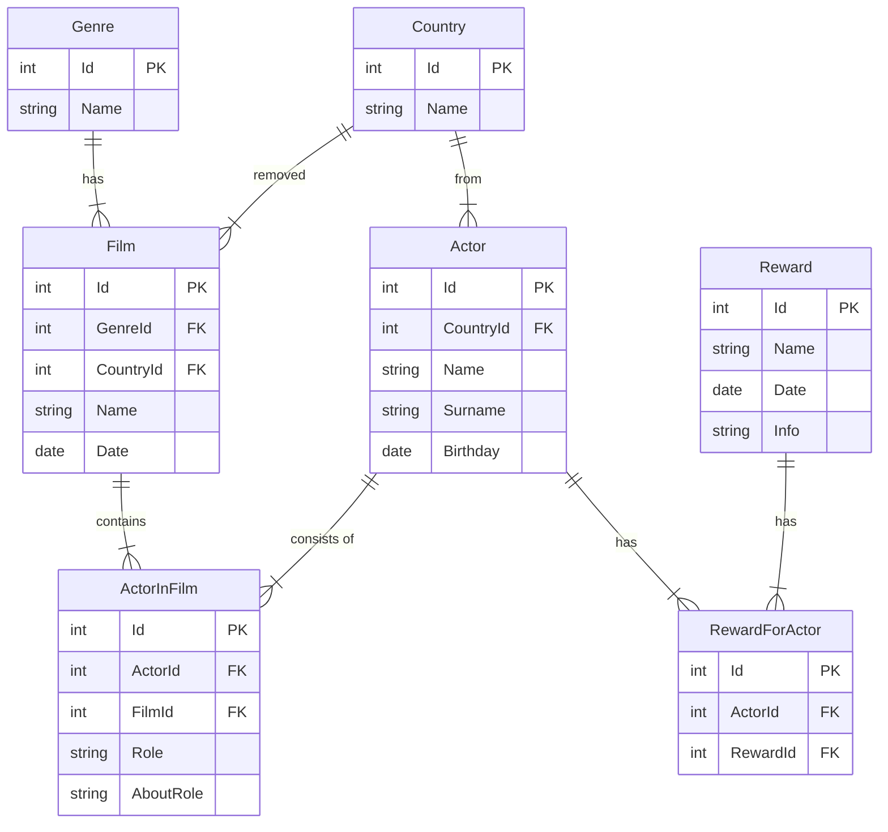

# Work with Database in android

## About

> [!NOTE]
> Actors information.

## Task

1. Create ER-diagram
2. Create entities, daos and database in project
3.

## ER-diagram

### [Er-diagram in dbdesign.io](https://dbdiagram.io/d/fot-mobile-project-65322f7dffbf5169f0165d7d)
